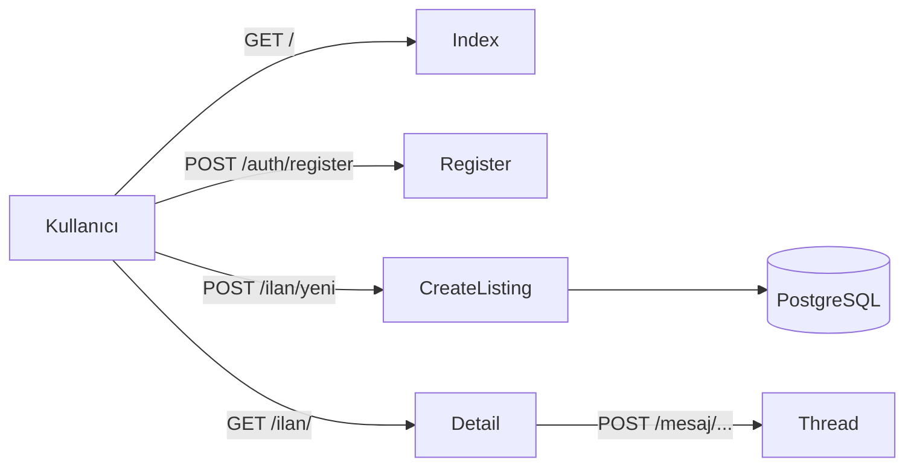

# Proje Raporu — İkinciElMarket

> **Bu dosya bir ŞABLON.** Aşağıdaki 7 başlığı kendi cümlelerinle doldurman gerekiyor.
> Kelime hedefi: 800-1200.

---

## 1. Projenin Amacı ve Ne İşe Yaradığı

İkinciElMarket, kullanıcıların ellerindeki ürünleri kolayca ilanlayıp satabildiği, alıcılarla
mesajlaşıp pazarlık yapabildiği bir ikinci-el alım-satım platformudur. Sahibinden / Letgo
tarzı sitelerin küçük bir kopyası olarak tasarlandı; amaç Flask Mega-Tutorial'ın tüm temel
konseptlerini (auth, ORM, formlar, blueprint, deploy) tek bir uygulamada ele almak.

[Buraya kendi cümlelerinden 2-3 cümle daha ekle — örn. "Bu projeyi seçmemin nedeni..."]

## 2. Mimari Özet

[Klasör yapısı diyagramı: README.md'deki ağacı buraya kopyala veya draw.io'da çiz.]

**Ana akışlar:**
1. Anonim kullanıcı → anasayfa → arama / kategori filtreleme → ilan detay
2. Kayıt / giriş → ilan ver → görsel yükle → yayınla
3. Alıcı → ilan detay → "Satıcıya mesaj at" → konuşma başlat
4. Admin → /admin → kullanıcı/ilan/kategori yönetimi

[Diyagram önerilir — örneğin Mermaid blok:]

## 3. Vibe Coding Deneyimi: Ne İşe Yaradı, Nerede Zorlandım?

[Burada kendi deneyimini yaz. Örnek başlangıç:]

**İşe yaradığı yerler:**
- Plan modunda büyük yapıları (auth blueprint'i) tek seferde planlamak işi inanılmaz hızlandırdı.
- Tekrar eden boilerplate (CRUD rotaları, form validatorler) için manuel yazmak zorunda kalmadım.
- ...

**Zorlandığım yerler:**
- Ajan ara sıra Flask 2.x API'si (örn. `@before_first_request`) önerdi; Flask 3.x ile uyumsuz.
- Ajan SQLAlchemy 1.x stilini (`db.Column`) ısrarla önerdi; her seferinde `Mapped[...]` istemek zorunda kaldım.
- ...

## 4. Antigravity'de En Faydalı Bulduğum 2 Özellik

1. **Plan modu (Plan Artifact):** Kod yazılmadan önce hangi dosyaların hangi sırayla
   oluşturulacağını gösterdi. Onayladıktan sonra hiçbir sürpriz çıkmadı. [Sen kendi deneyiminden]
2. **Walkthrough / Manager view:** Birden çok dosyaya yayılan değişikliği tek bir görünümde
   incelemek — diff'lere tek tek bakmaktan çok daha hızlıydı. [Sen kendi deneyiminden]

## 5. Ajanın Yakalayıp Düzelttiğim En Kritik 3 Hata

1. **[Örnek] User modelinde şifre alanı:** Ajan ilk planda `password = db.Column(db.String)`
   önerdi — yani DÜZ METİN saklama. Reddedip `password_hash` + `set_password/check_password`
   metotları ekletmeliyim. [Sen kendi yaşadığını yaz]
2. **[Örnek]** ...
3. **[Örnek]** ...

## 6. Eğer Projeyi Sıfırdan AI Olmadan Yapsaydım

[Kendi tahminin: kaç saat / hafta? Hangi kısımlar daha çok zaman alırdı? CSRF / form / migration
gibi boilerplate'i elle yazmak ne kadar sürerdi?]

## 7. Bu Projeyi Sürdürürsem Sonraki Adım

[Örnek fikirler:]
- Tam metin arama (PostgreSQL `tsvector` veya ElasticSearch)
- WebSocket ile gerçek zamanlı mesajlaşma
- Mobil uygulama için JWT-tabanlı `/api/v1/auth` endpoint'leri
- Stripe ile ödeme entegrasyonu (güvenli alışveriş)
- Görsel için S3 / Cloudflare R2 depolama
